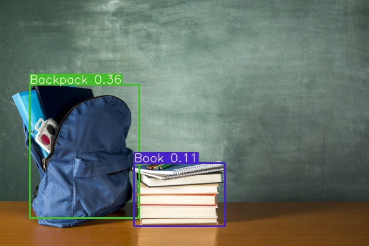
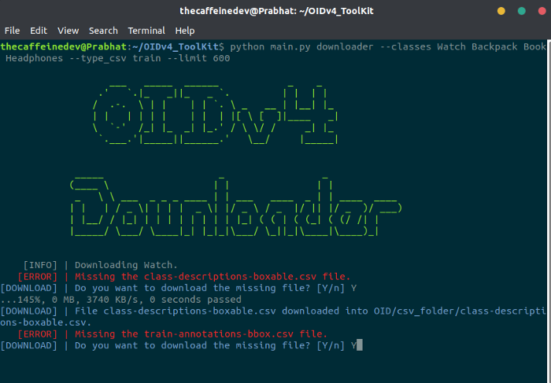
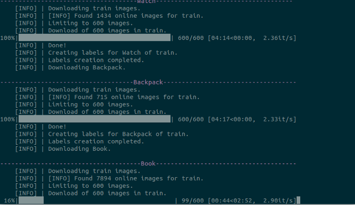
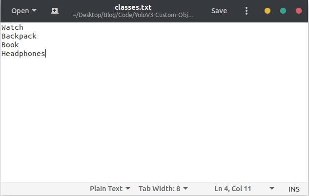
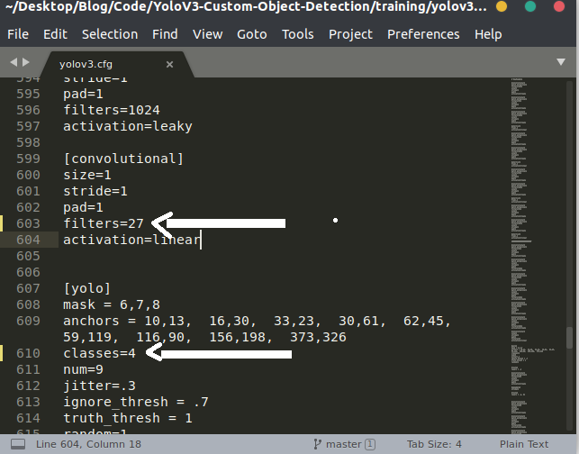
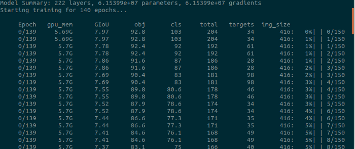
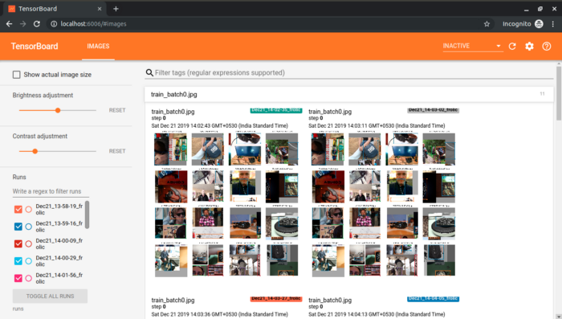
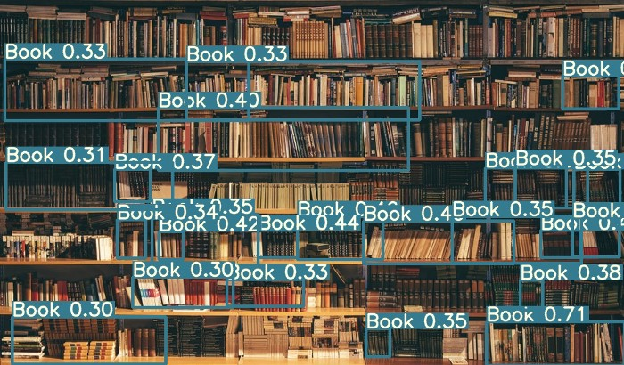

Object Detection is a task in computer vision that focuses on detecting objects in images/videos.


There are various object detection algorithms out there like YOLO (You Only Look Once,) Single Shot Detector (SSD), Faster R-CNN, Histogram of Oriented Gradients (HOG), etc.


### Prerequisites
It’s good to have a basic knowledge of deep learning computer vision. And basics of programming.


In this article, we are going to train our own custom yolov3 model for object detection.

**The steps needed are:**

1. Gathering data
2. Converting to YoloV3 format
3. Setting Training Pipeline
4. Training model
5. Exporting weights file.
6. Testing object detector

## Gathering data

We are going to get our data from [OpenImagesV5](https://storage.googleapis.com/openimages/web/visualizer/index.html?set=train&type=detection&c=%2Fm%2F0k5j). It was first introduced in 2016, It’s is a collaborative release comprising about nine million images annotated with labels covering thousands of object categories. The new version is an update on 2018’s [Open Images V4](https://storage.googleapis.com/openimages/web/factsfigures_v4.html).

Open Image V5 features newly added annotations on image segmentation masks for 2.8 million objects in 350 categories. Unlike bounding-boxes that only identify the general area in which an object is located, these image segmentation masks trace the outline of the target object, characterizing it's spatial extent with a higher level of detail.

I am going to choose 4 classes of my choice from OpenImagesV5 that is *Backpack, Watch, Book, and Headphones*. You can choose as many as you want.

We will have to download those images first. There’s an amazing [toolkit from GitHub](https://github.com/pythonlessons/OIDv4_ToolKit) with a full explanation of how to use it. This toolkit will help us to download the images. The toolkit installation is easy. [This guy](https://pylessons.com/YOLOv3-introduction/) has written a tutorial to detect custom objects using yolov3 using Keras. You can check it out, he has explained all the steps. In my post, I am going to use PyTorch and will try to simplify things as much as possible.

1. **Downloading the toolkit**

First, open up your terminal and clone the toolkit repository

```sh
git clone https://github.com/pythonlessons/OIDv4_ToolKit.git
```

Then go the folder by 

```
cd OIDv4_ToolKit
```

Install all the dependencies by 

```sh
pip3 install -r requirements.txt
```

2. **Using toolkit** **& Downloading the data**

First of all how to check if we can download the appropriate image class we need? You need to go to the OIDv5 homepage, click on explore and in a search tab try to find your desired class. In my example, I will search for “Watch”, “Backpack”, “Book”, and “Headphones”. To download all of them you can simply run

```bash
python3 main.py downloader --classes Watch Backpack Book Headphones --type_csv train --multiclasses 1 --limit 600
```

With this command, 600 training images for each class will get downloaded. If you are using for the first time it will ask you to download (train-annotations-bbox or test-annotations-bbox) CSV file. Type Y, while running the command so that it would get downloaded.





You need to wait for some time to finish the download.



This is the folder structure :

```
main_folder
│   - main.py
│   - oid_to_pascal_voc_xml.py
│   ..
└─── OID
    │
    └─── csv_folder
    │   │
    │   └─── class-descriptions-boxable.csv
    │   │
    │   └─── test-annotations-bbox.csv
    │   │
    │   └─── train-annotations-bbox.csv
    └─── OID
        │
        └─── Dataset
            │
            └─── train
                │
                └─── Watch_Backpack_Book_Headphones
```

## Converting to YoloV3 format

Open `oid_to_pascal_voc_xml.py` and edit line no. 9 and put 

```
XML_DIR = 'TO_PASCAL_XML'
```

Now you need to run 

```sh
python3 oid_to_pascal_voc_xml.py
```

to generate the object co-ordinates in XML formats. After running this above file, you will get object label files in an XML format in the TO_PASCAL_XML folder.

Again we need to convert it into YoloV3 format.

To train a Yolo model there are requirements how an annotation file should be made:

- One row for one image;
- Row format: image_file_path box1 box2 ... boxN;
- Box format: x_min,y_min,x_max,y_max,class_id (no space).
- Here is an example:
  -  path/to/img1.jpg 50,100,150,200,0 30,50,200,120,3
  -  path/to/img2.jpg 120,300,250,600,4
        ...

Now you will have to do some little bit of work with these. Have patience, it’s going to take some manual work now.

I will use the code of [Ultralytics](https://github.com/ultralytics/yolov3) to train our YoloV3 model. Make sure to check their repository, it’s great. I have made some changes in the folder structure and all for our own model. Now clone my repository for the next steps.

```
git clone https://github.com/TheCaffeineDev/YoloV3-Custom-Object-Detection.git
```

This is the folder structure

```
main_folder
│   - detect.py
│   - models.py
│   - train.py
│ 	- test.py
│ 	- requirements.txt
│ 	...
└─── cfg
└─── conversion
    │
    └─── output
    └─── xmls
    │  - classes.txt
    │  - xmltotxt.py
    │  ...
└─── data
└─── training
│	│
│	└─── images
│	└─── labels
│	- object.names
│	- trainer.data
│	- yolov3.cfg
│	- train_test.py
│
└─── utils
└─── weights
```

Now inside the main folder and run this in your terminal to install all the required dependencies.

```sh
pip3 install -r requirements.txt
```

Then you have to go back to that OIDV4_Toolkit folder `OIDv4_ToolKit/OID/Dataset/train/Watch_Backpack_Book_Headphones/` .  Here you need to copy all the images into the following folder in our cloned repository `/YoloV3-Custom-Object-Detection/training/images` And

you need to copy all the XML files which are in the folder to `/YoloV3-Custom-Object-Detection/conversion/xmls` folder. Don't get confused about these above steps.

After copying go to the `conversion` folder.  You need to edit the `classes.txt ` file and put your own classes there.

It looks like this:





Now in conversion folder run

```sh
# In YoloV3-Custom-Object-Detection/conversion folder
python3 xmltotxt.py -xml xmls -out output 
```

This will generate all the label files in the yolov3 format inside the output folder.

## Setting Training Pipeline

Now you have to copy all the `.txt` files which are in `YoloV3-Custom-Object-Detection/conversion/output`  folder to `YoloV3-Custom-Object-Detection/training/labels` folder.

Now go to the `YoloV3-Custom-Object-Detection/training` folder. Now we will edit some files here. Now open that `object.names` file and edit it out with your own classes. Mine looks like this

Now in

```sh
# In YoloV3-Custom-Object-Detection/training folder
python3 train_test.py
```

This above file will generate `train.txt` and `test.txt`.  You can open and check the file for more details. Basically we are splitting 70% & 30% for training and testing respectively.

Then open `trainer.data`  . It looks like this. You need to put your no. of classes in the first line,  `train.txt` and `test.txt` path in 2nd and 3rd line, `object.names` path in the 4th line.

Mine looks like this


Now you need to edit the `.cfg` file. By default each YOLO layer has 255 outputs: 85 outputs per anchor [4 box coordinates + 1 object confidence + 80 class confidences], times 3 anchors.

In our case we are using only four classes, then we need to edit the filter. You can reduce filters to `filters=[4 + 1 + n] * 3`, where `n` is your class count. This modification should be made to the layer preceding each of the 3 YOLO layers. Also, modify `classes=80 ` to `classes=n` in each YOLO layer, where `n` is your class count.

In our case in `yolov3.cfg` file  I changed the batch size & subdivisions which is in line no. **6** and **7**.  Then line no **610** (classes=4)  and **603** (filters=27), then line no. **689** & **696**, lastly line no. **776** & **783**. If you are using, line no. will be different.




Now we are ready to train our yolov3 model.

## Training Model

Below is my desktop specification in which I am going to train my model.

- **GPU:** NVIDIA GeForce RTX *2080 SUPER* (8GB)
- **RAM:** 16GB DDR4
- OS: Ubuntu 18.04

Now in `YoloV3-Custom-Object-Detection` folder open terminal and run

```sh
# In YoloV3-Custom-Object-Detection do
python3 train.py --epochs 110 --data training/trainer.data --cfg training/yolov3.cfg --batch 16 --accum 1 
```

There are optional arguments are there, you can check-in `train.py` file.

Also, You can **Update hyperparameters** also such as LR, LR scheduler, optimizer, augmentation settings, multi_scale settings, etc in `train.py` for your particular task. I would recommend you start with all-default settings first updating anything.





To run tensorboard while training, open another terminal and run

```sh
# In YoloV3-Custom-Object-Detection do
tensorboard --logdir=runs
```




It took me 2 hours to train four objects with 110 epochs.


If you follow the above steps, you will be able to train your own model properly.

## Exporting weights file

After training the model, we can get the weights file in the weights folder. It’s in `PyTorch` model format. We need to convert it to `darknet` format to test it out. Let's convert it first. Open up the terminal and run

```sh
# convert cfg/pytorch model to darknet weights
# In YoloV3-Custom-Object-Detection
python3  -c "from models import *; convert('training/yolov3.cfg', 'weights/best.pt')"

```
You will get this message after conversion.
```
Success: converted 'weights/yolov3-spp.pt' to 'converted.weights'
```
Now we will test our object detector. You will have the `converted.weights ` in `YoloV3-Custom-Object-Detection` folder.

## Testing Object Detector

Now to run inference, open up your terminal and run

```bash
# In YoloV3-Custom-Object-Detection
python3 detect.py --source 0 --weights converted.weights --cfg training/yolov3.cfg --names training/object.names --img-size 416
```

Check `detect.py` for details.

- Image: ` --source file.jpg `
- Video:  ` --source file.mp4 `
- Directory: ` --source dir/ `
- Webcam:  `--source 0 `
- RTSP stream:  `--source rtsp://192.168.0.1/rtp/470011235daa `

Some of the image inferences below you can see:





Due to the GitHub file size limit, I couldn’t upload it to GitHub. If you want to test my weight file, you can get it by

```bash
wget https://www.dropbox.com/s/tou8f0xvs8wdt8a/converted.weights
```

Link to the repository: https://github.com/TheCaffeineDev/YoloV3-Custom-Object-Detection

If you want to label your own custom images you can use [LabelImg](https://github.com/tzutalin/labelImg).The process of training and all is almost the same.

If you have any questions, recommendations or critiques, I can be reached via [Twitter](https://twitter.com/thecaffeinedev) or via my [mail](mailto:iprabhatdev@gmail.com). Feel free to reach out to me.

***Thank You***

### References and Credit

1. [Medium blog](https://medium.com/syncedreview/google-releases-open-image-v5-launches-open-image-challenge-91fa802f0edf)
2. [Ultralytics repo](https://github.com/ultralytics/yolov3)
3. [Pylessons](https://pylessons.com/)