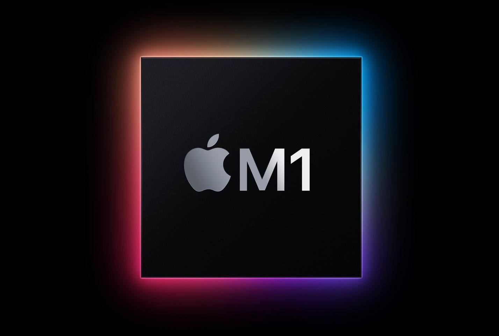

This blog is all about setting up Tensorflow on M1 Mac.

Last year in November 2020 apple releases their first ARM64-based M1 chip. It got a lot of attention from everyone.
Being a tech enthusiast and a programmer, I was amazed to see the performance of the new apple M1 chip. The benchmarks were really good.

Recently only some months back, I bought myself an M1 Macbook Pro with 8Gigs of RAM and 512GB of SSD.

I wanted to set up and test how machine learning frameworks are working in this new chip. Here are the setup instructions for Tensorflow.
Currently TensorFlow 2.4 for Apple Silicon currently available from Github in release 0.1 alpha 3.

***Note***: For now it cannot yet be used to a professional extend but it’s possible to work on a few prototype personal projects.

Before jumping into, I hope Homebrew is already installed in your system if not you can install it by running the following in your terminal

```
/bin/bash -c "$(curl -fsSL https://raw.githubusercontent.com/Homebrew/install/HEAD/install.sh)"

```

After it gets installed, install wget
```
brew install wget
```

Here are the things that we are going to do.

- Step 1: Xcode Command Line Tools
- Step2: Install Miniforge
- Step3: Create a virtual environment with python3.8
- Step4: Clone Tensorflow2.4 Repo from Apple and install Tensorflow & its packages
- Step5: Install Jupyter Notebook, Pandas
- Step6: Run a Benchmark by training the MNIST dataset


## Step1: Install Xcode Command Line Tools

I have already installed Xcode Command Line Tools on my mac. If it’s not already installed in your system, you can install it by running the following command below in your terminal.

```
xcode-select --install
```

## Step2: Install Miniforge

Install miniforge for arm64 (Apple Silicon) from [miniforge GitHub](https://github.com/conda-forge/miniforge).

Miniforge enables installing python packages natively compiled for Apple Silicon.

After the installation of miniforge, by default, it gives us one base environment. You can turn off the default base env by running

```
conda config --set auto_activate_base false
```

### Step3: Create a virtual environment

Let’s create a virtual environment named mlp with python3.8 installed.
```
conda create --name mlp python=3.8
```


And activate it by running
```
conda activate mlp
```

## Step4: Installing Tensorflow-MacOS

Let’s download and install TensorFlow-macOS from [Apple Github](https://github.com/apple/tensorflow_macos/releases/tag/v0.1alpha3)

At this time of writing this blog Tensorflow, 0.1 alpha 3(TF 2.4) is the latest one. You can either download or you can do wget.

```
wget https://github.com/apple/tensorflow_macos/releases/download/v0.1alpha3/tensorflow_macos-0.1alpha3.tar.gz
tar -xvf tensorflow_macos-0.1alpha3.tar.gz
cd tensorflow_macos/arm64
```


Install some dependencies by running
```
conda install -c conda-forge -y cached-property six

pip install --upgrade --no-dependencies --force numpy-1.18.5-cp38-cp38-macosx_11_0_arm64.whl grpcio-1.33.2-cp38-cp38-macosx_11_0_arm64.whl h5py-2.10.0-cp38-cp38-macosx_11_0_arm64.whl tensorflow_addons_macos-0.1a3-cp38-cp38-macosx_11_0_arm64.whl
```


Then
```
conda install -c conda-forge -y absl-py astunparse gast opt_einsum termcolor wheel typing_extensions typeguard jupyter pandas
```

```
pip install wrapt flatbuffers tensorflow_estimator google_pasta keras_preprocessing protobuf
```
And finally install Tensorflow
```
pip install --upgrade --force --no-dependencies tensorflow_macos-0.1a3-cp38-cp38-macosx_11_0_arm64.whl

```


## Step6: Run a Benchmark by training the MNIST dataset

Let’s install Tensorflow Datasets

```
pip install tensorflow_datasets
```
Make sure your conda environment is activated.

Let’s open a Jupyter Notebook and do the benchmark. In your terminal run

```
jupyter notebook
```

It will open a browser window

Create a new python3 notebook


I got the code snippet from

https://github.com/apple/tensorflow_macos/issues/25

Copy and paste this code below in the new notebook

```
%%time
import tensorflow.compat.v2 as tf
import tensorflow_datasets as tfds
tf.enable_v2_behavior()
from tensorflow.python.framework.ops import disable_eager_execution
disable_eager_execution()
from tensorflow.python.compiler.mlcompute import mlcompute
mlcompute.set_mlc_device(device_name='gpu')
(ds_train, ds_test), ds_info = tfds.load(
    'mnist',
    split=['train', 'test'],
    shuffle_files=True,
    as_supervised=True,
    with_info=True,
)
def normalize_img(image, label):
  """Normalizes images: `uint8` -> `float32`."""
  return tf.cast(image, tf.float32) / 255., label
batch_size = 128
ds_train = ds_train.map(
    normalize_img, num_parallel_calls=tf.data.experimental.AUTOTUNE)
ds_train = ds_train.cache()
ds_train = ds_train.shuffle(ds_info.splits['train'].num_examples)
ds_train = ds_train.batch(batch_size)
ds_train = ds_train.prefetch(tf.data.experimental.AUTOTUNE)
ds_test = ds_test.map(
    normalize_img, num_parallel_calls=tf.data.experimental.AUTOTUNE)
ds_test = ds_test.batch(batch_size)
ds_test = ds_test.cache()
ds_test = ds_test.prefetch(tf.data.experimental.AUTOTUNE)
model = tf.keras.models.Sequential([
  tf.keras.layers.Conv2D(32, kernel_size=(3, 3),
                 activation='relu'),
  tf.keras.layers.Conv2D(64, kernel_size=(3, 3),
                 activation='relu'),
  tf.keras.layers.MaxPooling2D(pool_size=(2, 2)),
#   tf.keras.layers.Dropout(0.25),
  tf.keras.layers.Flatten(),
  tf.keras.layers.Dense(128, activation='relu'),
#   tf.keras.layers.Dropout(0.5),
  tf.keras.layers.Dense(10, activation='softmax')
])
model.compile(
    loss='sparse_categorical_crossentropy',
    optimizer=tf.keras.optimizers.Adam(0.001),
    metrics=['accuracy'],
)
model.fit(
    ds_train,
    epochs=12,
    validation_data=ds_test,
)

```
You will get the output below. The time to run may be different


It took a total of 2min 37s second to run 12 epochs with 128 batch size.

You can use any other code editor or any other way to do the test benchmark also.

***Conclusion***


As you can see Tensorflow is successfully installed in our system and we are able to run some code also.

If you have any questions, recommendations, or critiques, I can be reached via [Twitter](https://twitter.com/thecaffeinedev) or via my [mail](iprabhatdev@gmail.com). Feel free to reach out to me.


### References:

- https://blog.tensorflow.org/2020/11/accelerating-tensorflow-performance-on-mac.html
- https://github.com/apple/tensorflow_macos/issues/3
- https://github.com/apple/tensorflow_macos
- https://github.com/apple/tensorflow_macos/issues/25