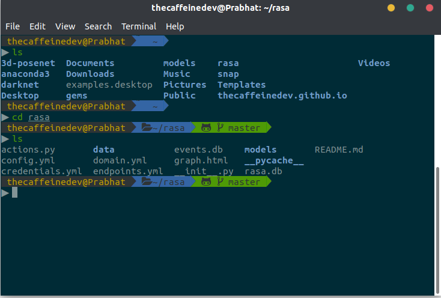

In this blog post, I will cover how to install Oh My Zsh and How to customize your terminal and make it fancy.

## Update the packages

```sh
sudo apt-get update
sudo apt upgrade
```

## Install prerequisite packages (ZSH, powerline & powerline fonts)

```
sudo apt install zsh
sudo apt-get install powerline fonts-powerline
```


## Clone the Oh My Zsh Repo

```
git clone https://github.com/robbyrussell/oh-my-zsh.git ~/.oh-my-zsh
```

## Create a New ZSH configuration file

```
cp ~/.oh-my-zsh/templates/zshrc.zsh-template ~/.zshrc
```

## Install PowerLevel9k!

```
git clone https://github.com/bhilburn/powerlevel9k.git ~/.oh-my-zsh/custom/themes/powerlevel9k
```

## Set up a theme for your Terminal — Open `.zshrc` File using gedit editor

And change and put these lines :

```sh
ZSH_THEME="powerlevel9k/powerlevel9k"POWERLEVEL9K_DISABLE_RPROMPT=true
POWERLEVEL9K_PROMPT_ON_NEWLINE=true
POWERLEVEL9K_MULTILINE_LAST_PROMPT_PREFIX=”▶ “
POWERLEVEL9K_MULTILINE_FIRST_PROMPT_PREFIX=””
```


## Change your Default Shell

```
chsh -s /bin/zsh
```

for this command to be effective you need to restart your system.

# Oh My Zsh Terminal

After restarting your terminal will look like this :


## If you want Syntax Highlighting

Clone the ZSH Syntax Highlighting

```
git clone https://github.com/zsh-users/zsh-syntax-highlighting.git “$HOME/.zsh-syntax-highlighting” — depth 1
```

Add syntax-highlighting in `.zshrc` Configuration

```
echo “source $HOME/.zsh-syntax-highlighting/zsh-syntax-highlighting.zsh” >> “$HOME/.zshrc”
```

And If anything goes wrong, you can revert back to your default shell by

```
chsh -s /bin/bash
```

If you are a data science enthusiast and using anaconda then you need to add these lines below in zshrc file.

Open a terminal and

```
gedit .zshrc
```

add these. Make sure to change your username after home.

```sh
\# >>> conda initialize >>>
\# !! Contents within this block are managed by ‘conda init’ !!
__conda_setup=”$(‘/home/yourusername/anaconda3/bin/conda’ ‘shell.bash’ ‘hook’ 2> /dev/null)”
if [ $? -eq 0 ]; then
 eval “$__conda_setup”
else
 if [ -f “/home/yourusername/anaconda3/etc/profile.d/conda.sh” ]; then
 . “/home/yourusername/anaconda3/etc/profile.d/conda.sh”
 else
 export PATH=”/home/yourusername/anaconda3/bin:$PATH”
 fi
fi
unset __conda_setup
\# <<< conda initialize <<<
```

Mine looks like this.


Then do

```
source ./zshrc
```

There are a lot of customization available. You can check Oh my zsh and Powerlevel9k repository.

If you have any questions, recommendations or critiques, I can be reached via [Twitter](https://twitter.com/thecaffeinedev) or via my [mail](mailto:iprabhatdev@gmail.com). Feel free to reach out to me.

***Thank You***

**Acknowledgment**

1. [Oh My Zsh — ](https://github.com/ohmyzsh/ohmyzsh)
2. [Powelevel9k](https://github.com/Powerlevel9k/powerlevel9k)