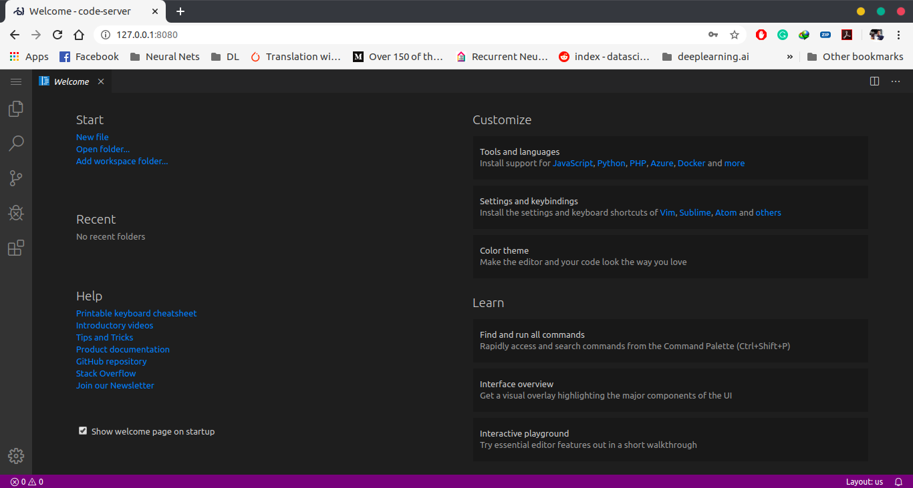

I have been into this programming field since my college days and I have tried a lot of editors over time. As a developer, I believe a code editor is one of the most important tool that a developer can have.

Before I was happy with Sublime Text and Atom for most of the part because it could do everything I needed in my tech stack.

I switched to VS Code for the following reasons:

1. **Git integration**: I actually prefer to use Terminal for anything to do with Git but the VS Code git system is really great.
2. **Integrated terminals**: You get a complete terminal emulator, out of the box.
3. **Speed & Extensions:** VS Code is not as fast as Sublime Text but it feels faster than Atom. It has thousands of extensions available that cover pretty much every use case I can think of.
4. **IntelliSense:** Intellisense is incredible.VS Code has more intelligent language support, autocompletion, and suggestion. It’s super helpful, sometimes I don’t have to look up various functions and methods.
5. **Completely Free:** It is open source and updates are very much frequent.

And there’s more.

Anyway, this blog post is about how to run VS Code in your browser. I am using Ubuntu 18.04 btw. Ubuntu 20.04 will also work fine.

First go to this URL

[Code server releases](https://github.com/cdr/code-server/releases/) and download the binary file for Linux.


Then unzip it.


Then go inside the unzipped folder.


Inside that folder, the code-server is the binary file and you can run it by

```
./code-server
```

As you can see it’s running on my localhost.

If you want your own password, you can add your own password by

```
PASSWORD=prabhat ./code-server --host 0.0.0.0 --port 8080
```


You can change your port if you want to.

Then you have to go to your local address. In my case it’s

```
http://127.0.0.1:8080/
```

It will ask you to enter your password.


After entering your password, you will see your code server up and running.




So that’s it.

I do use the desktop based VSCode for day-to-day coding purpose. But sometimes when needed, running VS code on my browsers saves me time and makes me more productive.

And I think a code editor is simply a tool. It doesn’t matter whether you choose Sublime Text or VS Code or any other. What matters is it works for you.

Thanks for reading. Did this article help you out? If it did, I hope you consider sharing it. You might help someone else out. Thank you so much!