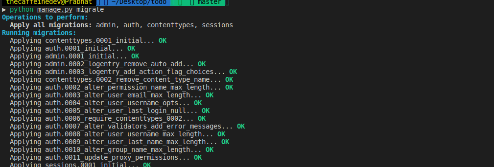
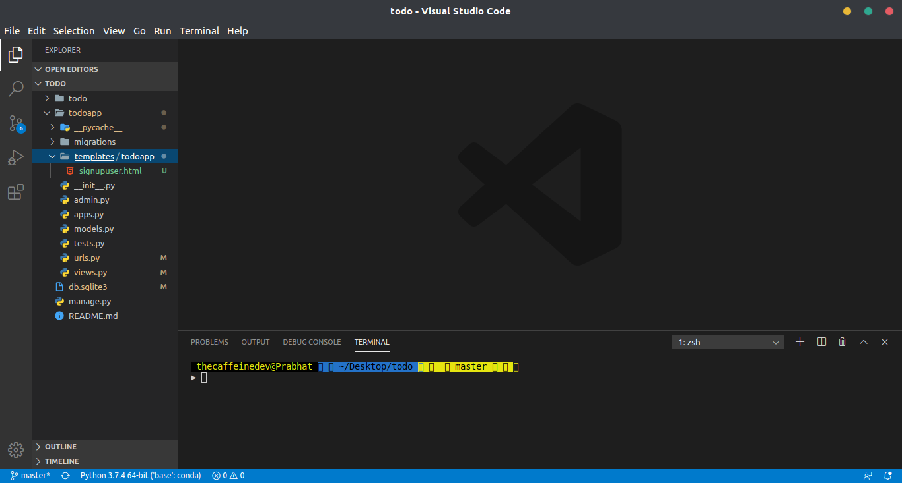
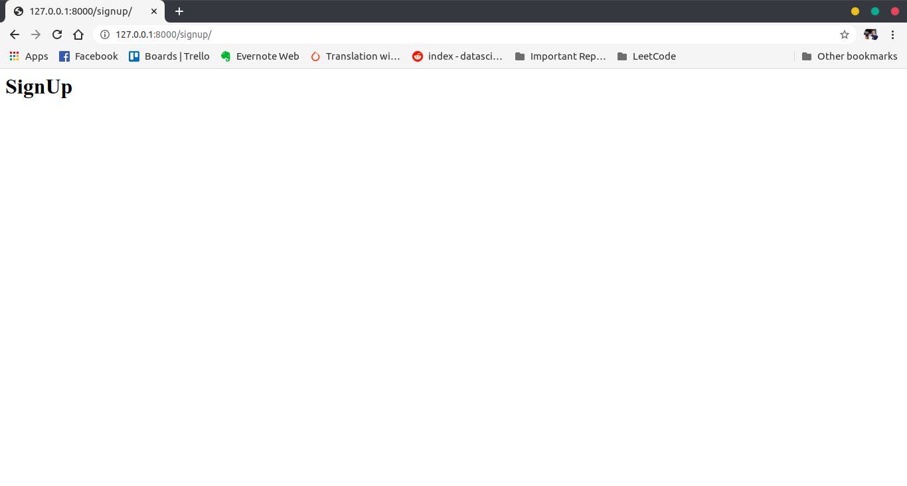
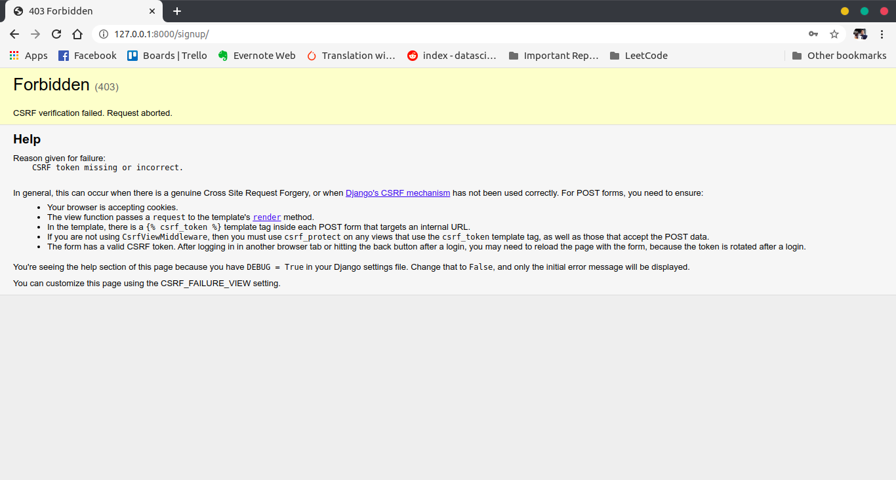

This is the second part of our Intro To Django Tutorial, if you haven't gone through our previous tutorial please make sure to check it out.


In this part of tutorial, we are going to do our migrations, create a sign up form and stuff.


So we need to think of our TodoApp features & functionalities first.

#### Features

- User SignUp
  - User should have an unique username
  - User should give a password
- User SignIn
  - After registration, user should be able to sign by using username and password
- After SignIn
  - User should be able to add todo
    - A todo will have one title and a memo
    - User can also specify if a todo is important or not
  - User can see the todo's
  - User can update, delete or mark complete on a todo.
- User can logout


So these are the features that we are going to work on. 


Whenever we are working on this kind of projects or any big projects where there are multiple functionalities and moving pieces like here in our todo there is signup, signin, creating todo's, listing todo's and all, sometimes it's harder to think like where should I even start the project.

So for me personally, I like to think from the User point of view, like If I am the user, If I will not be able to create todo's without signup first right. I will not be able to logout If I don't have an account and so on. 

I would like to first SignUp in the website then, I will be able to login, then I will able to add my todo's, see all todo's, update or delete them when needed. 


This gives us a clear idea where to being the project, like we need to implement user SignUp first, then we can work on login, logout and then we can move into creating todo objects, listing them, updating them and so on. If we kind of follow this flow, it will be really helpful for us to know where we are moving in our project. 

Let's go to our project folder named **todo** and run the server.


You can see it's giving us an warning saying *"You have 17 unapplied migration(s). "* so let's do the migrations, to do it run

```sh
python manage.py migrate
```




According to documentation, Migrations are Django’s way of propagating changes you make to your models (adding a field, deleting a model, etc.) into your database schema. They’re designed to be mostly automatic, but you’ll need to know when to make migrations when to run them, and the common problems you might run into.


So let's move forward and create a templates folder inside our  todoapp folder. And then create a todo folder inside the templates. 

Then I need you to create an HTML file called 'signupuser.html'. If you didn't understand whatever I have written here, just look at the project structure 

```
 |-- todo/
 |    |-- todoapp/                <-- our django app!
 |    |    |-- migrations/
 |    |    |    +-- __init__.py
 |    |    |-- templates/
 |    |    |	+-- todoapp/
 |    |    |			+-- signupuser.html
 |    |    |-- __init__.py
 |    |    |-- admin.py
 |    |    |-- apps.py
 |    |    |-- models.py
 |    |    |-- tests.py
 |    |    +-- views.py
 |    |-- todo/            			<-- our django project folder!
 |    |    |-- __init__.py
 |    |    |-- asgi.py
 |    |    |-- settings.py
 |    |    |-- urls.py
 |    |    |-- wsgi.py
 |    +-- manage.py
```

Here only I have created a folder called templates inside the todoapp, and inside the templates I have created another folder called todoapp. Then inside that I have created a file called signupuser.html. 



Make sure to follow the same names and same folder structure. If you still get confused, you can checkout my Github repo for code.


Now open the 'signupuser.html' and edit it out with the code below.

***signupuser.html***

```html
<h1> Sign Up </h1>
```

Now open the views.py inside the todoapp folder and remove the code which was written in our previous section and replace with this code. 

**views.py**

```python
from django.shortcuts import render
from django.http import HttpResponse

# Create your views here.
def signupuser(request):

    return render(request, 'todoapp/signupuser.html')

```

I hope this code is self explanatory, here in the first line we have imported render, which simply renders HTML  templates. We have already talked about HttpResponse before.

Then we have created a signupuser function which takes a request and it returns us the *signupuser.html* file.


Let's edit the Urls.py file inside our todoapp folder. Remove the code which was written in our previous tutorial and replace with the code below.

 **Urls.py** 

```python
from django.urls import path
from . import views

urlpatterns = [
    path('signup/',views.signupuser, name ='signupuser')
]
```

Again we have went through this code structure in our part-1 of the tutorial series.  Here we have added the path "signup/". 

Now let's run the server

```sh
python manage.py runserver 
```

And go to

http://127.0.0.1:8000/signup/

You will see the page below, if you are not able to see, you have done something wrong in the process. 





Now just we are simply rendering the HTML templates, for now there's nothing except the SignUp header. Later we will add design and make it look good.


#### Basic Sign Up

Django has some built in tools  that you can use to set up the ability for users to log in and log out of a web application. 

The most simple way to implement a user sign up is by using the [**UserCreationForm**](https://docs.djangoproject.com/en/3.0/topics/auth/default/). If you are wondering where this form came from, remember Django comes with some of it's in built apps. The auth app provides this form.

So now let's open view.py and edit it out with the code below.

**views.py**

```python
from django.shortcuts import render
from django.http import HttpResponse
from django.contrib.auth.forms import UserCreationForm

# Create your views here.
def signupuser(request):

    return render(request, 'todoapp/signupuser.html', {'form':UserCreationForm()})

```

Here what's new in this file, in the 3rd line you can see we have imported the *UserCreationForm*. This UserCreationForm gives us a basic form and we can pass it forward to our templates.

In the line 8, we have added a dictonary where the key is the form and the value is UserCreationForm() object.

Read more about why we used the dictionary in the above code from [documentation.](https://docs.djangoproject.com/en/3.0/ref/templates/api/#django.template.Context) 

To simply understand now, we can pass the form object to our HTML template by using the UserCreationForm Object. Read more about it [here.](https://docs.djangoproject.com/en/3.0/ref/templates/language/)


Now let's edit signupuser.html file.

**signupuser.html** 

```html
<h1>SignUp</h1>

{{ form }}

```

And now if you run the server and go to http://127.0.0.1:8000/signup/  you will be able to see the page below.


So this Django in-built UserCreationForm gives us a basic form. If you didn't get the syntax which we have used in the signupuser.html file. You can read more about it [here.](https://docs.djangoproject.com/en/3.0/ref/templates/language/)

Now let's again edit the signupuser.html file.

**signupuser.html** 

```html
<h1>SignUp</h1>

<form method="POST">

{{ form.as_p }}

<button type="submit">Sign Up</button>

</form>

```

Here we have added HTML form. And the method is POST. *POST* is for writing data, meaning data will be submitted.

Now if you save the file and run the sever you will see the page below


Now if you try to fill in some details in the form and if you press submit button you will get this error below. Make sure to try it out so that you understand things better.



Now we got the error saying CSRF token missing. To fix this error 

Edit this file

**signupuser.html** 

<script src="https://gist.github.com/TheCaffeineDev/5929a348496cfa46ff17f49fc8e12cad.js"></script>

We have added something called *csrf_token*


This is a special token aimed at combating something called Cross Site Request Forgery, which you can learn more about here: [**Cross-Site Request Forgery (CSRF)**](https://www.owasp.org/index.php/Cross-Site_Request_Forgery_(CSRF)).


Now if you try to give some inputs and submit it, you will not get any error. 


So that's it for this tutorial, I hope you understood most of things from here. Try to read more from the links that I have referenced in the tutorial. 


You can get code for this second part from my [Github Repo](https://github.com/TheCaffeineDev/Django-TodoApp/tree/e99688c3e79cfa110ff93d92234d90a797ae180b).

So that's it for this tutorial series. I am not going to make any more part on this thing. This part is an optional tutorial of how to think more and build more features if you are building some apps.

Thanks for reading