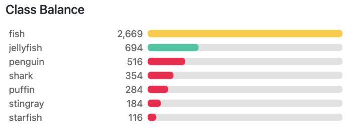
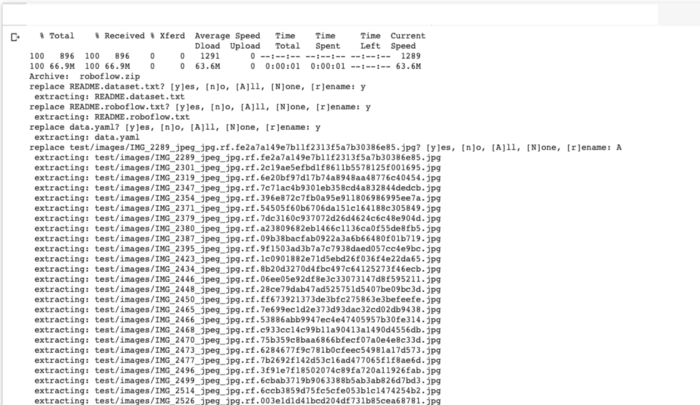
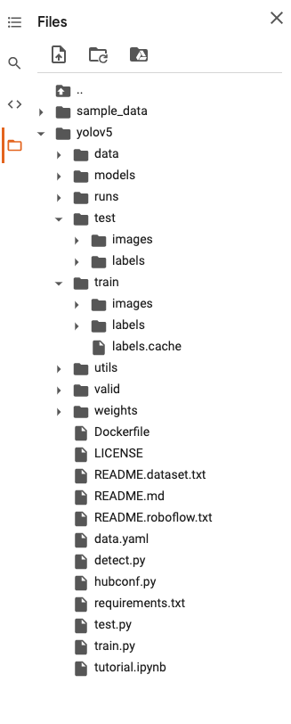
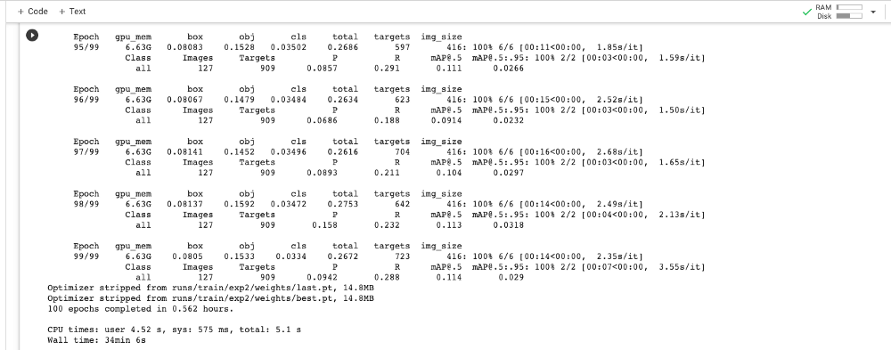
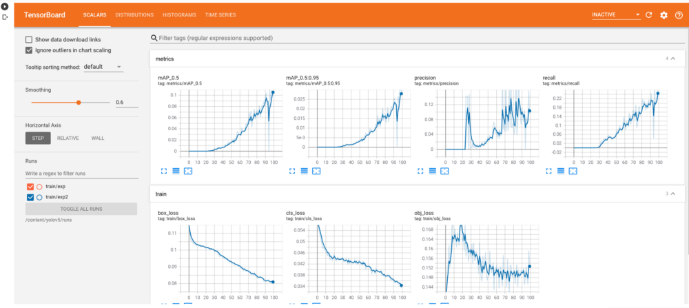
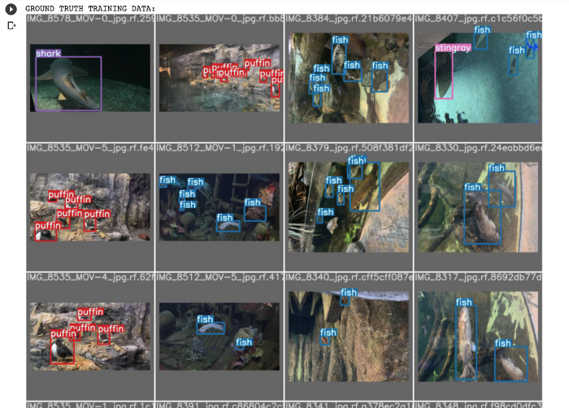
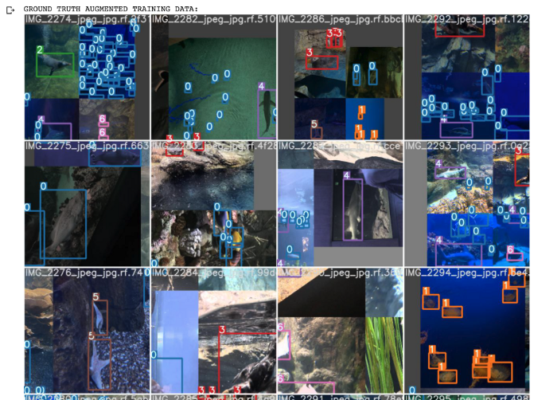
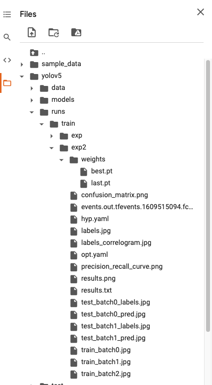
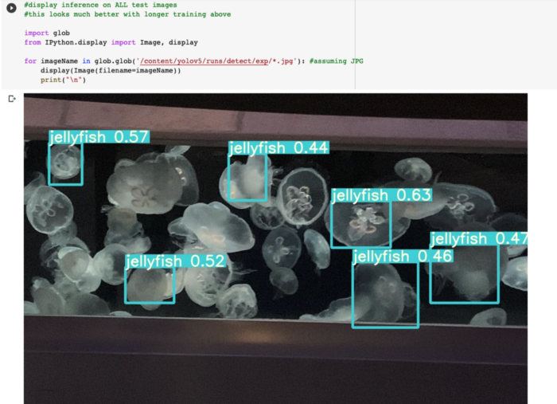
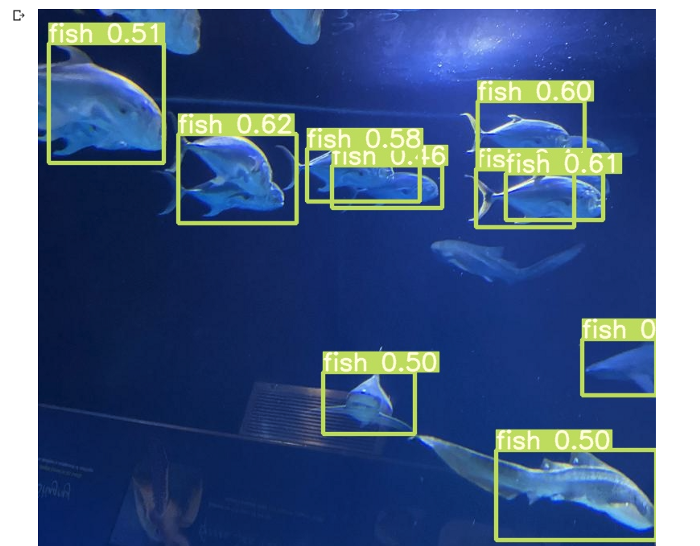

Object Detection is a task in computer vision that focuses on detecting objects in images/videos.

There are various object detection algorithms out there like YOLO (You Only Look Once,) Single Shot Detector (SSD), Faster R-CNN, Histogram of Oriented Gradients (HOG), etc.


In this article, we are going to use Yolo-V5 to train our custom object detection model. YOLO is one of the most famous object detection models.


Version 1.0 of YOLO-V5 got released on 27 May 2020 by [Glenn Jocher](https://www.linkedin.com/in/glenn-jocher)  who is the founder & CEO of [Utralytics](https://github.com/ultralytics). It’s written in PyTorch and it’s available in [Github](https://github.com/ultralytics/yolov5).


### Prerequisites
It’s good to have a basic knowledge of deep learning computer vision. And how to work in a Google Colab environment.

### Steps Covered in this Tutorial
1. To train our own custom object detector these are the steps to follow
2. Preparing the dataset
3. Environment Setup: Install YOLOv5 dependencies
4. Setup the data and the directories
5. Setup the YAML files for training
6. Training the model
7. Evaluate the model
8. Visualize the training data
9. Running inference on test images
10. Export the weight files for later use


### Preparing the dataset
We are going to use the [Aquarium Dataset](https://public.roboflow.com/object-detection/aquarium) which is available in [Roboflow Public Object Detection datasets](https://public.roboflow.com/object-detection). You can check out more datasets that are there.


The aquarium dataset consists of 638 images. The images were already labeled by the Roboflow team. It has 7 classes such as fish, jellyfish, penguins, sharks, puffins, stingrays, and starfish, and most images contain multiple bounding boxes.

To download the dataset you need to create a roboflow account first. It’s very simple and easy.





If you want to use your own images you can use annotation tools such as [LabelImg](https://github.com/tzutalin/labelImg), [CVAT](https://github.com/openvinotoolkit/cvat) or you can try any large-scale solutions like Scale or AWS Ground Truth.

When you are annotating yourself make sure to follow the best practices. Check this [link](https://nanonets.github.io/tutorials-page/docs/annotate) out for more details.

After the dataset is prepared then we are all set to set up the environment and train the dataset.

### Environment Setup

Here’s the link to my Notebook: [Google Colab](https://colab.research.google.com/drive/16QCaYzTuHCOF9CQLQYmGNxmtY1xKAIdn?usp=sharing)

You need a google account to use Google Colab. You can either use my notebook to train or you can create your own notebook and follow along.

In Google Colab, you will receive a free GPU for 12 hours. If you use a new notebook in Colab change the runtime session to GPU.

If you are planning to use my notebook then make sure to File → save a copy in your drive. Then you will be able to edit the code.

### Installation of the dependencies


```
!git clone https://github.com/ultralytics/yolov5  # clone repo!pip install -U -r yolov5/requirements.txt  # install dependencies
```


Somehow the PyTorch version didn’t get compatible with the GPU so I installed another version of PyTorch by 


```
#installing for google colab GPU use
!pip install torch==1.6.0+cu101 torchvision==0.7.0+cu101 -f https://download.pytorch.org/whl/torch_stable.html
```

You might not need to do this.

```
%cd /content/yolov5
!ls
```

We can import and take a look at our GPU Specification provided by Google Colab.

```import torch
from IPython.display import Image  # for displaying images
from utils.google_utils import gdrive_download  # for downloading models/datasets
print('Using torch %s %s' % (torch.__version__, torch.cuda.get_device_properties(0) if torch.cuda.is_available() else 'CPU'))
```

Here’s what I got

```
Using torch 1.6.0+cu101 _CudaDeviceProperties(name='Tesla T4', major=7, minor=5, total_memory=15079MB, multi_processor_count=40)

```


Google Colab comes preinstalled with Cuda and Torch and some other dependencies. If you are planning to train locally then you will have to setup Cuda and the dependencies on your own. I will surely make a tutorial about it later on.


### Setup the data and the directories

After the environment set up is done. We can import the dataset into colab. As I am using the Roboflow dataset I will be downloading, if you plan to use your own you can import it using Google Drive.

```
# You need to sign up in roboflow to get the key and then you can use the dataset
!curl -L “https://public.roboflow.com/ds/PUT YOUR OWN KEY HERE” > roboflow.zip; unzip roboflow.zip; rm roboflow.zip

```

This will download the data, unzip and save it inside the yolov5 directory.




#### Project Folder structure



### Setup the YAML files for training

To train a YOLO-V5 model, we need to have two YAML files.

The first YAML to specify:

- where our training and validation data is
- the number of classes that we want to detect
- and the names corresponding to those classes

This YAML of ours looks like this:

```
train: ./train/images 
val: ./valid/images  
nc: 7 
names: ['fish', 'jellyfish', 'penguin', 'puffin', 'shark', 'starfish', 'stingray']

```

The second YAML is to specify the whole model configuration. You can change the network architecture in this step if you want but we will go with the default one.

The YAML which we term `custom_yolov5s.yaml`:

```
# parameters
nc: 7  # number of classes  # CHANGED HERE
depth_multiple: 0.33  # model depth multiple
width_multiple: 0.50  # layer channel multiple

# anchors
anchors:
  - [10,13, 16,30, 33,23]  # P3/8
  - [30,61, 62,45, 59,119]  # P4/16
  - [116,90, 156,198, 373,326]  # P5/32

# YOLOv5 backbone
backbone:
  # [from, number, module, args]
  [[-1, 1, Focus, [64, 3]],  # 0-P1/2
   [-1, 1, Conv, [128, 3, 2]],  # 1-P2/4
   [-1, 3, BottleneckCSP, [128]],
   [-1, 1, Conv, [256, 3, 2]],  # 3-P3/8
   [-1, 9, BottleneckCSP, [256]],
   [-1, 1, Conv, [512, 3, 2]],  # 5-P4/16
   [-1, 9, BottleneckCSP, [512]],
   [-1, 1, Conv, [1024, 3, 2]],  # 7-P5/32
   [-1, 1, SPP, [1024, [5, 9, 13]]],
   [-1, 3, BottleneckCSP, [1024, False]],  # 9
  ]

# YOLOv5 head
head:
  [[-1, 1, Conv, [512, 1, 1]],
   [-1, 1, nn.Upsample, [None, 2, 'nearest']],
   [[-1, 6], 1, Concat, [1]],  # cat backbone P4
   [-1, 3, BottleneckCSP, [512, False]],  # 13

   [-1, 1, Conv, [256, 1, 1]],
   [-1, 1, nn.Upsample, [None, 2, 'nearest']],
   [[-1, 4], 1, Concat, [1]],  # cat backbone P3
   [-1, 3, BottleneckCSP, [256, False]],  # 17 (P3/8-small)

   [-1, 1, Conv, [256, 3, 2]],
   [[-1, 14], 1, Concat, [1]],  # cat head P4
   [-1, 3, BottleneckCSP, [512, False]],  # 20 (P4/16-medium)

   [-1, 1, Conv, [512, 3, 2]],
   [[-1, 10], 1, Concat, [1]],  # cat head P5
   [-1, 3, BottleneckCSP, [1024, False]],  # 23 (P5/32-large)

   [[17, 20, 23], 1, Detect, [nc, anchors]],  # Detect(P3, P4, P5)
  ]

```


We can put the YAML file anywhere we want because we can reference the file path later on. But it’s a good idea to put it inside the YoloV5 directory.

### Training the model

After the configuration is done we can begin our training.

There are multiple hyperparameters that we can specify which are:

- img: define input image size
- batch: determine batch size
- epochs: define the number of training epochs.
- data: set the path to our YAML file
- cfg: specify our model configuration
- weights: specify a custom path to weights
- name: result names
- nosave: only save the final checkpoint
- cache: cache images for faster training

We need to specify the path of both YAML files which we created above.


```
%cd /content/yolov5/
!python train.py --img 416 --batch 80 --epochs 100 --data './data.yaml' --cfg ./models/custom_yolov5s.yaml --weights ''
```


With 100 epochs the training got completed within 35 minutes.




### Evaluate the model

Training losses and performance metrics are saved to Tensorboard and also to a logfile defined above with the `— name` flag when we train. In our case, we named this `yolov5s_results`. (If given no name, it defaults to `results.txt`.) The results file is plotted as a png after training completes.

Partially completed results.txt files can be plotted with `from utils.utils import plot_results; plot_results()`.


```
# Start tensorboard
# Launch after you have started training to all the graphs needed for inspection
# logs save in the folder "runs"
%load_ext tensorboard
%tensorboard --logdir /content/yolov5/runs
```



### Visualize the training data

After training starts, view `train*.jpg` images to see training images, labels, and augmentation effects. We can visualize both Ground Truth Training data, as well as Ground Truth, Augmented data.


```
# first, display our ground truth data
# The ground truth [Train data] is available in jpg file at location /content/yolov5/runs/train/exp2/test_batch0_labels.jpg
print("GROUND TRUTH TRAINING DATA:")
Image(filename='/content/yolov5/runs/train/exp2/test_batch0_labels.jpg', width=900)
```


```
# print out an augmented training example
# Below is the augmented training data.
# NOTE: The dataset already contains the augmented data with annotations, so that you dont have to do it.
print("GROUND TRUTH AUGMENTED TRAINING DATA:")
Image(filename='/content/yolov5/runs/train/exp2/train_batch0.jpg', width=900)
```




### Running inference

Using the final trained weight which got saved after training we can run our inference

#### Weights folder




To run the model inference we can use the following command.

```
# use the best weights!
# Final weights will be by-default stored at /content/yolov5/runs/train/exp2/weights/best.pt
%cd /content/yolov5/
!python detect.py --weights
/content/yolov5/runs/train/exp2/weights/best.pt --img 416 --conf 0.4 --source ./test/images
```

- — source: input images directory or single image path or video path
- — weights: trained model path
- — conf: confidence threshold

This will process the input and store the output in our inference directory.

Here are some output images:






### Export the weights for later use

Now that we have successfully trained our custom model. We can download the weight files and save them in our local directory or in Google Drive.

To do so we import a Google Drive module and send them out

```
from google.colab import drive
drive.mount('/content/gdrive')
%cp /content/yolov5/runs/train/exp2/weights/best.pt /content/gdrive/My\ Drive
```

### Conclusion

I hope you were able to follow along and was able to train successfully.

I have uploaded the notebook, config files, and weight to my Github repository. You can check it out [here](https://github.com/TheCaffeineDev/YoloV5-Custom-Object-Detection).

If you have any questions, recommendations, or critiques, I can be reached via [Twitter](https://twitter.com/thecaffeinedev) or via my [mail](iprabhatdev@gmail.com). Feel free to reach out to me.

### References:
- Official Repo: https://github.com/ultralytics/yolov5
- [Roboflow dataset](https://public.roboflow.com/object-detection/aquarium) 
- [My Colab Notebook](https://colab.research.google.com/drive/16QCaYzTuHCOF9CQLQYmGNxmtY1xKAIdn?usp=sharing)
- [Roboflow Blog](https://blog.roboflow.com/how-to-train-yolov5-on-a-custom-dataset/)