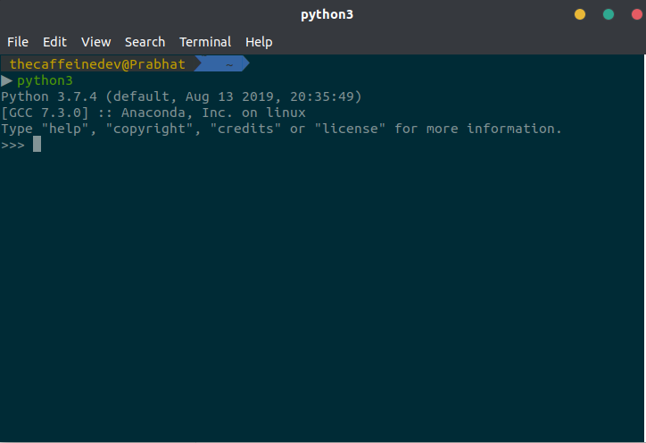
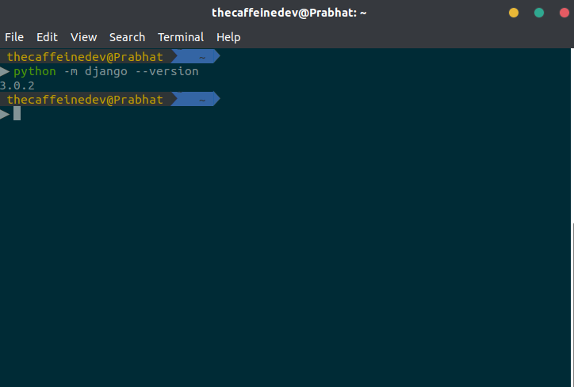
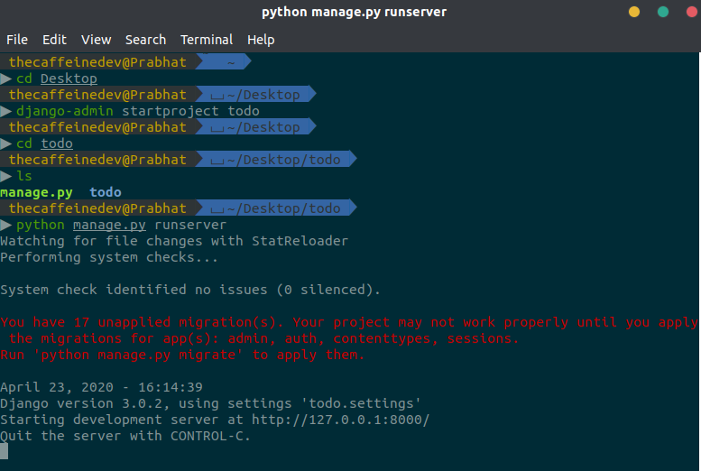

This is going to be a two part tutorial of how to get started with Django, learning the basics of django, understanding basics URL routing and stuff. We will discuss everything on our way of learning.


We are going to create a project named a todo in this tutorial. It doesn't have any functionalities but just to understand things better, we are going to refer it like that. So let's get started.


### What is Django ?

[Django](https://djangoproject.com/) is a high-level Python Web framework that encourages rapid development and clean pragmatic design. [**Web framework**](https://hackernoon.com/what-is-a-web-framework-173cac228b4) is a **set of components** designed to **simplify** your web development process and a standard way to develop websites fast and easily.

### Who uses Django ?

Instagram, Pinterest, Bitbucket, Disqus, Dropbox, Mozilla, National Geographic, Udemy, Spotify and many more sites. 

### Why you should use Django ?

- It’s fast and simple
- Clean & Rapid developement
- Very good documentation and high scalability.
- Maturity (It has been around 12 years)
- Default Admin Panel
- **ORM**. Django is valued for its object-relational mapper that helps developers interact with databases.
- It is a python based framework. If you know python then you are good to go.
- Secure
- And there are a lot of reasons you should.

### When to use Django ?

- When you’re building a highly customizable app, such as a social media website. You don’t have to worry about reinventing the wheel.
- As it's python based framework, you can[ utilise libraries of third-party extensions and plugins](https://djangopackages.org/) to customize your app however you wish.
- If you want to integrate Machine learning features in future.
- When you don’t want to work with database queries directly, and need ORM support.
- When you need to move fast, deploy fast, and also make changes as you move ahead.
- When you need an app that can grow in depth and complexity to any scale and is capable of handling as many visitors and/or transactions as demanded, Django shines.

### When not to use Django ?

- When you need to build a very basic app, which does not require database, file operations, or anything even remotely complex.
- When you want to build everything from scratch, and you know what you’re doing.

### What you need to get started with Django ?

- Basic Knowledge Of Python 3
- Basic Knowledge of Web development (HTML, CSS & JS)

## Let's get started

First you have to make sure that Python 3 is installed in your system. If you are using Ubuntu, you can open up your terminal check your python version like this

 


In my case I am using Python 3.7.4. I work mostly on Machine learning stuff so I am using Anaconda. You don't need to use anaconda, you just need python installed in your system.

It's a very good practice to use Virtual Environment while working on Django projects. A virtual environment is like having a sandbox for each  project. So you can play around, install packages, uninstall packages without breaking anything.

But in our first project we are not going to use any virtual environment. Later in other projects we will use Virtual Environment.

### Let's install Django 

It's very simple, open up your terminal or cmd in case you are using windows and do

```sh
pip3 install django
```

It will install the latest django version. In my case I am using Django 3.0.2. But any version of Django3. will be fine for this project.




Now we are all set up for our first django project.


#### Starting a New Project

Let's make sure we are in Desktop

```sh
cd Desktop
```

With Django installed, we have the *django-admin* command-line tool with which we can
generate our project:

```sh
django-admin startproject todo
```

At this point we should have an initial folder structure (in the current folder) that looks like this:

```
 |-- todo/             <-- django project folder
 |    |-- todo/
 |    |    |-- __init__.py
 |    |    |-- asgi.py
 |    |    |-- settings.py
 |    |    |-- urls.py
 |    |    |-- wsgi.py
 |    +-- manage.py
```

Let's go into the details of what all the files means.

- **manage.py :**  This is the command center for making non-code changes. Whether
  it's creating a database migration, running tests, or starting the development
  server, we will use this file often. It will allow us to interact with our Django project.
  
- **todo** : A python package that contains the files that every Django project needs.
  
  
  
  - **todo**/__ init__.py : This is an empty file that is  only needed to make the other files importable. It tells that this directory should be considered as a python package.
  - **todo**/asgi.py : It provides an interface between asynchronous Python web servers and frameworks.
  - **todo**/settings.py : This is where Django stores all the configuration for our app by
    default.  This file contains all the configuration of our project, and we can customize it.
  - **todo**/urls.py : This file contains all the URL  mappings to Python functions. Any URL that needs  to be handled by the project must have an entry here.
  - **todo**/wsgi.py : Web Server Gateway Interface (WSGI) is the interface between Python and a web server. You won't touch this file very much, but it's how your web server and your Python code know how to talk to each other. 

#### Starting the web server

Django comes with a simple web server installed. To run the server simply execute the command below:

```
# make sure you are in higher todo folder

python3 manage.py runserver
```

For now, you can ignore the migration errors, we will get to that later.




Now open the following URL in a Web browser: **http://127.0.0.1:8000** and you should see the following page:


If you see this page, this means you have successfully installed django, created a django project and run the development server.


Hit Control + C to stop the development server.

### Django Apps

We have two important concepts to discuss:

- **project**: In Django, a project is an entire application. A Django project may consist of a single app, or many apps to provide its service. For your example, the *project* is the whole website.

- **app**: is a Web application that does something. For example if you are build a e-commerce website then the examples of app would be shopping cart, payment, saved items and all. These all can be divided into multiple apps.


It’s important to note that you can’t run a Django **app** without a **project** . We have these structure because to organize the code structure and stuff.


So let's create our first **todo app**. To create an app, go to the directory where the **manage.py** file is and run the following command:

```sh
django-admin startapp todoapp
```

  

  We have used "startapp" command this time.

This will give us the following directory structure

```
 |-- todo/
 |    |-- todoapp/                <-- our new django app!
 |    |    |-- migrations/
 |    |    |    +-- __init__.py
 |    |    |-- __init__.py
 |    |    |-- admin.py
 |    |    |-- apps.py
 |    |    |-- models.py
 |    |    |-- tests.py
 |    |    +-- views.py
 |    |-- todo/
 |    |    |-- __init__.py
 |    |    |-- asgi.py
 |    |    |-- settings.py
 |    |    |-- urls.py
 |    |    |-- wsgi.py
 |    +-- manage.py
```

So let's understand what all the new files means.


- **migrations/**: here Django store some files to keep track of the changes you create in the **models.py** file, so to keep the database and the **models.py** synchronized.
- **admin.py**: This file is used for registering your django models to the Django Administration
- **apps.py**: This file is created to help the user include any application configuration for the app.
- **models.py**: This file is used to write Class based Models for our Django Applications.This will be the blueprint of our database design ,relationships and attribute constraints. The models are translated automatically by Django into database tables.
- **tests.py**: This file is used to write test cases for the Application. For time being we will not go into the details of this.
- **views.py**: this is the file where we handle the request/response cycle of our Web application.


Now that  we have created our first app, let's configure our project to use it.

To do that, open the **settings.py** and try to find the `INSTALLED_APPS` variable:


```python
INSTALLED_APPS = [
    'django.contrib.admin',
    'django.contrib.auth',
    'django.contrib.contenttypes',
    'django.contrib.sessions',
    'django.contrib.messages',
    'django.contrib.staticfiles',
]
```

As you can see, There are 6 built-in apps and they come with Django by default. Common functionalities that most Web applications need, like authentication, sessions, static files management (images, javascripts, css, etc.) and so on these apps provides us. 

We will explore all these apps later in our series of tutorial.

Let's add our todoapp in this **settings.py** 

```python
INSTALLED_APPS = [
    'django.contrib.admin',
    'django.contrib.auth',
    'django.contrib.contenttypes',
    'django.contrib.sessions',
    'django.contrib.messages',
    'django.contrib.staticfiles',
    
    'todoapp',
]

```

Always remember whenever you install a new app, you should add that app in the **settings.py** file. 


### Let's Write Our First Hello World! 

So let's write our first view. If you don't understand it completely for the first time that's fine. We will come back to these things later on also.

Open the **views.py** inside the **todoapp**

**views.py**

```python
from django.shortcuts import render
from django.http import HttpResponse

# Create your views here.
def index(request):
    return HttpResponse('Hello, World!')

```

Views are python functions. Whenever a url is called in Django, it finds corresponding function that is in **views.py**.

A *view* is a place where we put the "logic" of our application.

Let's go through the code closely.

- **Line 1** Imports the render() method. This is added automatically when you create an app in Django. We use this method when we want to render templates. We will cover this topic later in our series.
- **Line 2**. We have imported the **HttpResponse** method. As you know HTTP is the communication protocol used by all web browsers. It uses request and response to pass the data. The view receives an request object and retuns an **HttpResponse** Object.
- **Line 5,6**. This is our first view function. It's an example of function based view. We have created a function called index. That takes  **request** and will return the **HttpResponse**. It takes a request from our web browser and returns a response. In our case the response is simple *Hello, World!.*

### Configuring the URLs

Now we have to tell Django *when* to serve this view. 

Let's create a new file called **'urls.py'** inside our **todoapp.**

**urls.py**

```python
from django.urls import path
from . import views

urlpatterns = [
    path('', views.index, name="index"),
]
```

Let’s examine this code closely:

- **Line 1.** We import the path() function.  It is used to configure URLs. In its basic form, the  ***path()*** function has a very simple syntax:	

```python
  path(route, view)
```

- **Line 2** . Here we import our views file from our todoapp. Here you can see we have used dot notation. A single dot means that the module referenced is in the same directory as the current location. It is good practice to use that.

- **Line 4.** Lists the URL patterns registered for this app. For readability, the list is broken into multiple lines, with one URL pattern per line.

- **Line 5.**  It is the the actual URL dispatcher. A request to the http://127.0.0.1:8000/ of the website would be routed to the **index** function in the application's **views.py** file. This path takes an optional name argument and any number of additional keyword arguments passed as a Python dictionary.

- **views.index.** Points to our index view. I.e., the dot operator is pointing to the *index view* inside the **views.py** file that we imported in Line 2.

  

  The *path()* function statements are kept in a special file called urls.py.

  

  Don’t worry if this is a bit confusing right now, it will make a lot more sense once you have written a couple of views.

  

When we created our project, it created a **urls.py**  file in our **todo** folder*(todo\urls.py)*. This is a good place for site-wide navigation but is rarely a good place to put URLs relating to individual applications. Having all our URLs in the one file is more complex and less portable and it's bad if two apps use a view with the same name.

To solve this problem we create a new **urls.py** file for each application. 


After doing all these, there's one more step. We need to make some changes in our (***todo/todo/urls.py*** ) file to make it work.

***todo/todo/urls.py***

```python
from django.contrib import admin
from django.urls import path, include

urlpatterns = [
    path('admin/', admin.site.urls),
    path('', include('todoapp.urls')),
]
```

We have made some changes to the file:

- In **Line 2** we have added include() function to our imports.
- In **Line 6** we have added a URL dispatcher. This dispatcher is  simply including **urls.py** file from the todoapp. 

Now If you now run the development server, and navigate to `http://127.0.0.1:8000/` in your browser, you should this home page.


That’s it! You just created your very first view.


So this is it for this section. In our next section we will discuss more about models and stuff.


You can get the code from my Github Repository. 


##### References

- https://medium.com/crowdbotics/when-to-use-django-and-when-not-to-9f62f55f693b
- https://www.netguru.com/blog/when-to-choose-django
- https://djangostars.com/blog/why-we-use-django-framework/
- https://simpleisbetterthancomplex.com/series/2017/09/04/a-complete-beginners-guide-to-django-part-1.html
- https://medium.com/srp-labs/building-practical-web-applications-with-react-django-3675085a001b
- https://tutorial.djangogirls.org/en/django_views/
- https://djangobook.com/mdj2-django-views/